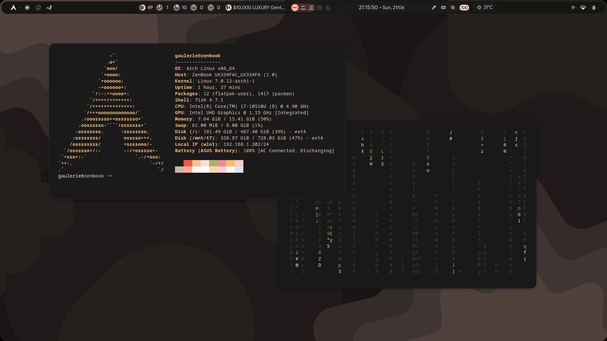
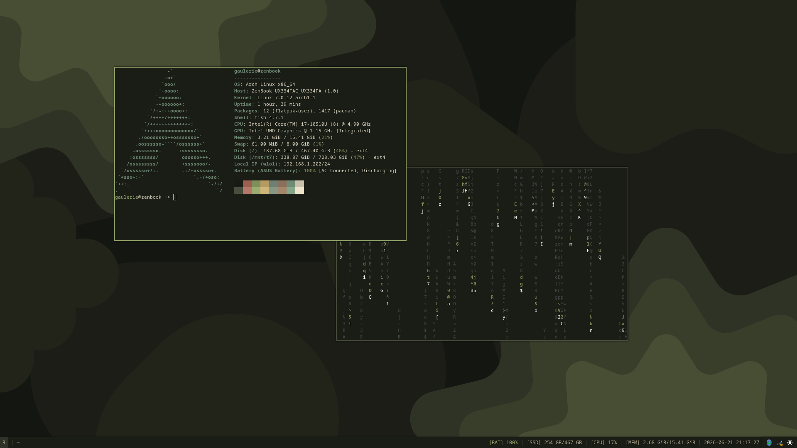

# dotfiles

My personal dotfiles. Running a personal fork of [illogical-impulse](https://github.com/end-4/dots-hyprland) on Hyprland, and a simple i3 configuration.

| hyprland | i3 |
|----------|-----|
|  |  |

Files are mirrored at their `$HOME`-relative paths so they're easy to browse. Most config is personal and not username-dynamic. Feel free to use anything as inspiration.

## Install

Use [ungaul/athome](https://github.com/ungaul/athome) to install them if needed.
